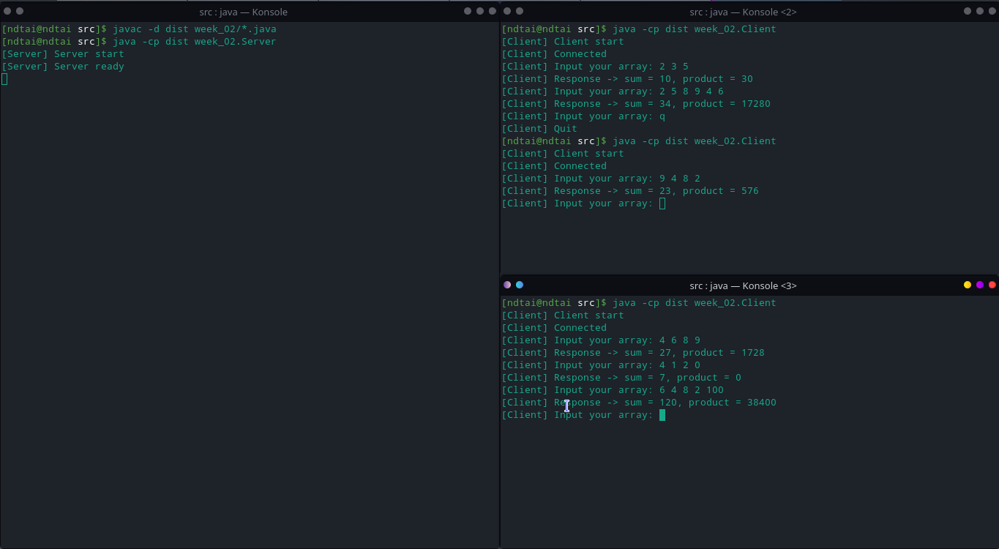

## Thành viên nhóm:

- Nguyễn Đức Tài - 18021111
- Nguyễn Mạnh Hiếu - 17020743

## Các bước để chạy chương trình

- Sau khi giải nén ta được thư mục $dir/week_02
- Ở thư mục $dir ta mở terminal sau đó
- Biên dịch mã nguồn: ```javac -d dist week_02/*.java```
- Chạy Server: ```java -cp dist week_02.Server```
- Mở terminal mới cũng tại $dir chạy máy ảo Client: ```java -cp dist week_02.Client```
- Nhập dữ liệu...

Note: rmiregistry được tạo ngay trong [Server.java](./Server.java) nên không cần khởi tạo rmiregistry riêng, nếu rmiregistry/tiến trình khác đang sử dụng cổng 1099 thì có thể tắt tiến trình đó hoặc dổi giá trị port trong mã nguồn ở 2 tệp [Client.java](./Client.java) và [Server.java](./Server.java)
## Ảnh chụp màn hình
