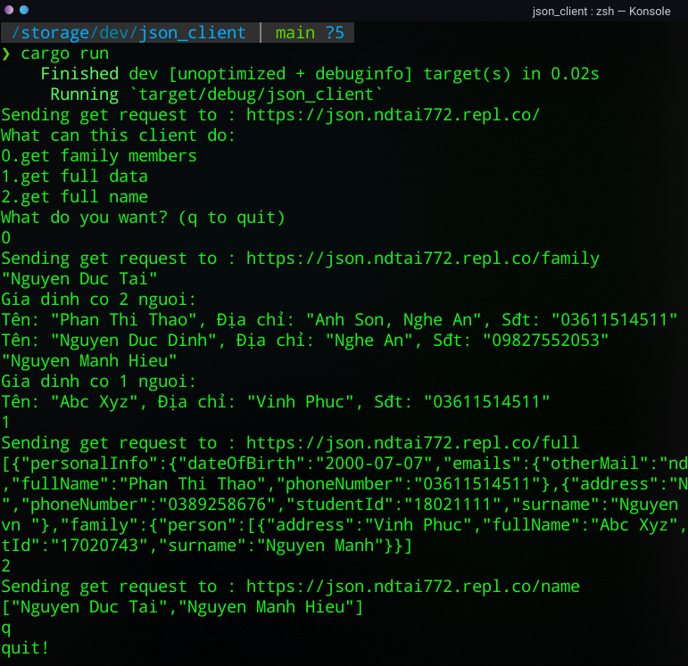
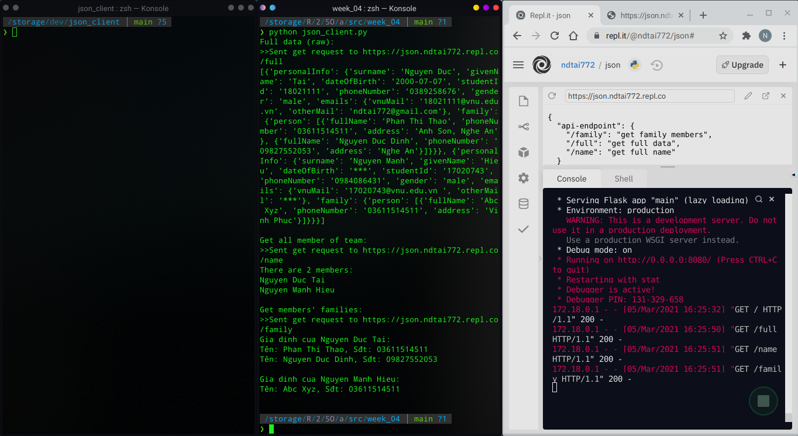
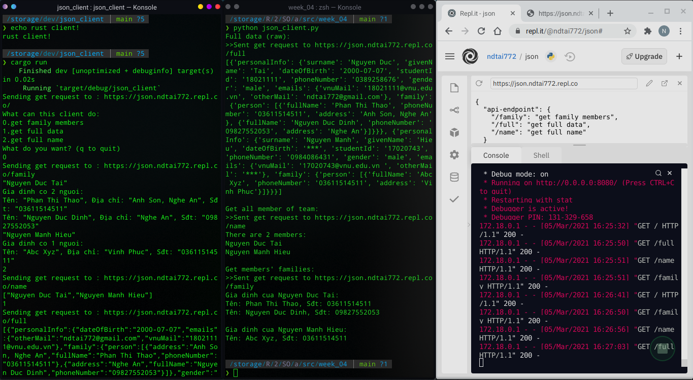

# Báo cáo tuần 4
## Thành viên nhóm:
- Nguyễn Đức Tài - 18021111
- Nguyễn Mạnh Hiếu - 17020743
## Tóm lược:
- Server: Nhóm đã làm server bằng Python (Flask) - sử dụng trang web [repl.it](repl.it) để host backend
- Client: Gồm 2 client 1 viết bằng Python (sử dụng thư viện request http client) và 1 viết bằng Rust (dùng curl-rs)
- Mã nguồn cụ thể ở trong các file đính kèm
## Các bước thực hiện
- Chạy server -> server trả về 1 cổng kết nối tại địa chỉ `https://json.ndtai772.repl.co`, api xây dựng đơn giản gồm 3 endpoint, dữ liệu được lưu tại file data.json phía server, server đọc file và xử lý dữ liệu để trả về cho endpoint tương ứng:
    - /full: toàn bộ dữ liệu
    - /name: tên các thành viên trong nhóm
    - /family: danh sách gia đình của mỗi người
- Chạy client -> Client gửi request đến các endpoint và lấy dữ liệu về (dạng json) sau đó xử lý json sang thông tin dạng thông báo và hiển thị (demo với chức năng hiển thị gia đình)
## Ảnh minh họa

