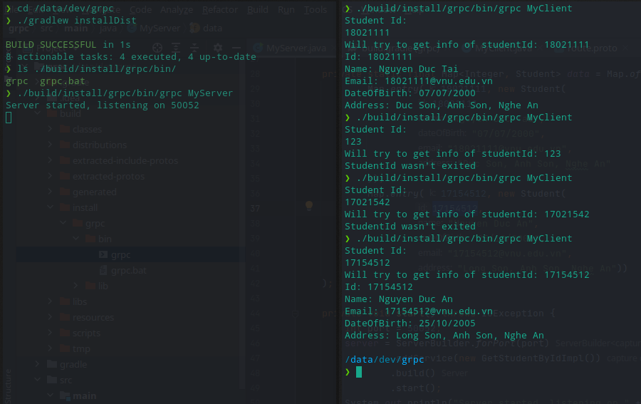

# Báo cáo tuần 5 - gRPC
## Thành viên nhóm:
- Nguyễn Đức Tài - 18021111
- Nguyễn Mạnh Hiếu - 17020743
## Về chương trình:
Gồm 3 phần Client và Server và Proto Buffer

Cấu trúc request: Gồm 1 trường thông tin duy nhất: studentId
```proto3
message StudentId{
  int32 id = 1;
}
```

Cấu trúc response: Gồm các trường thông tin cơ bản: Id, họ tên, địa chỉ, email, ngày sinh
```proto3
message StudentInfo{
  int32 id = 1;
  string name = 2;
  string dateOfBirth = 3;
  string email = 4;
  string address = 5;
}
```

## Câc bước chạy chương trình: 
- Load gradle (tải các thư viện cần thiết về grpc)
- Build gradle (generate code java từ proto buffer), release binary file
```gradle
./gradlew build
./gradlew installDist
```
- Chạy Server
```shell
./build/${class-path}/grpc MyServer
```
- Chạy Client
```shell
./build/${class-path}/grpc MyServer
```
- Nhập thông tin cần thiết và test

## Hình ảnh chạy chương trình:
